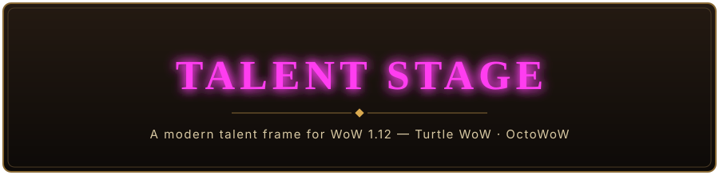
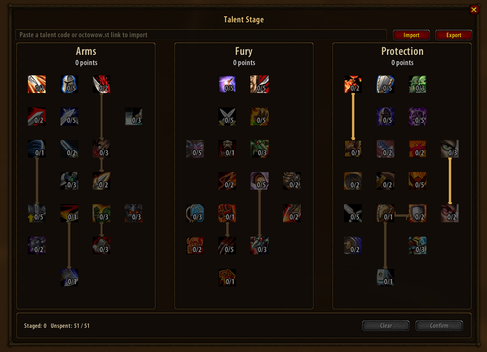
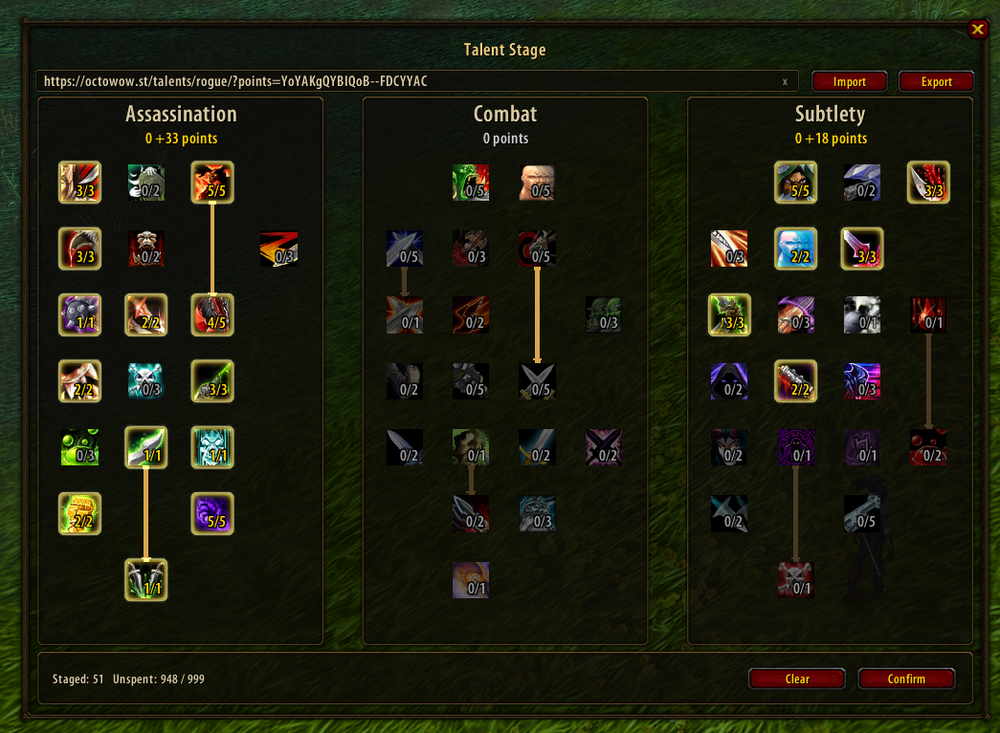
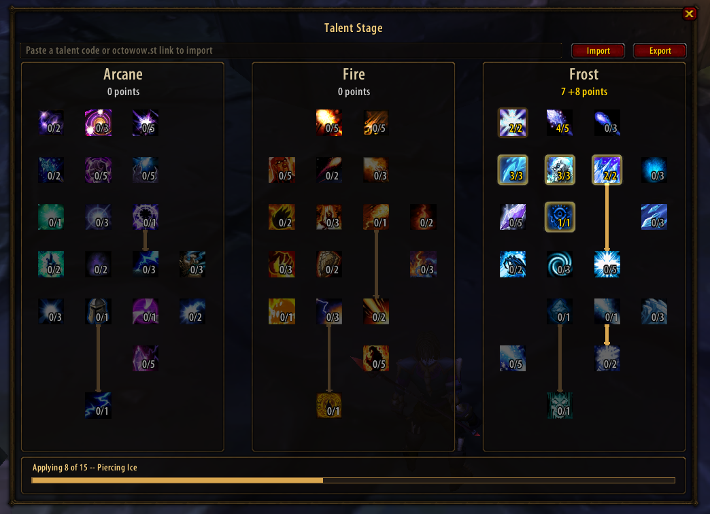

# Talent Stage

A drop-in replacement for the default WoW 1.12 talent frame. All three
specialization trees are visible at once, side by side, with no internal
scrolling — and a **stage-then-confirm** flow, so clicking a talent marks it
as planned without spending the point until you confirm.

Built for the stock 1.12.1 client used by Turtle WoW and OctoWoW-style
servers.

  
  

## Features

- All three trees rendered together, sized to the tree's actual data —
  no fixed grid assumptions.
- **Stage before you spend**: plan across all three trees, confirm or clear,
  never misclick a permanent point.
- **See it land**: staged glow, live progress bar, and a lock-in flash with
  sound as each confirm run applies.
- Prereq connector lines drawn from the tree's real prerequisite data, gold
  when met and gray when not — a prereq line only lights up once its source
  talent is fully maxed, not just started.
- Right-click a staged talent to unstage it.
- Import/export build codes compatible with octowow.st's talent calculator,
  applying through the same progress bar as a manual confirm.
- Reads real server talent data live, no hardcoded tree layout — works on
  modified trees (see [Compatibility note](#compatibility-note)).

## Installation

**Recommended:** download the latest release, already correctly named, no
extra steps.

1. Download the latest release: [Releases
   page](https://github.com/Azax-Dev/talent-stage/releases/latest).
2. Extract it — you'll get a `TalentStage` folder, ready to use as-is.
3. Move it into `Interface/AddOns/` in your WoW installation.
4. Launch WoW, or `/reload` if it's already running.

Installing from source instead (git clone or branch zip)

If you clone the repo or use GitHub's "Download ZIP" button on the branch
instead of a release, the folder won't be pre-named — rename it to exactly
`TalentStage` before moving it into `Interface/AddOns/`, or the addon will
silently fail to load with no error.

Open your talent pane as usual (default `N` keybind, or the micro-menu
button) — Talent Stage replaces it automatically. Useful slash commands:
`/ts` or `/talentstage` (with no arguments, lists the available
subcommands).

## Compatibility note

Talent Stage reads its data live from the client — `GetTalentInfo` and
`GetTalentPrereqs` — every time it draws a tree. It does not hardcode any
particular server's talent layout, tiers, columns, or prerequisites, so it
should work unmodified against any server running a stock-shaped 1.12
talent API, including servers that have customized their talent trees.

## Credits

- Talent Stage is written and maintained by **Azax**.
- The build import/export feature is compatible with the codes produced by
  [Haaxor1689/talent-builder](https://github.com/Haaxor1689/talent-builder)
  (used by octowow.st's talent calculator), which inspired the feature.
  Talent Stage's codec is an independent Lua implementation of the format —
  it reads and writes the same codes, but shares no code with that project.

## Support

If Talent Stage is useful to you, consider [buying me a coffee on
Ko-fi](https://ko-fi.com/azaxuk). Never required, always appreciated.

## License

MIT — see [LICENSE](LICENSE).
