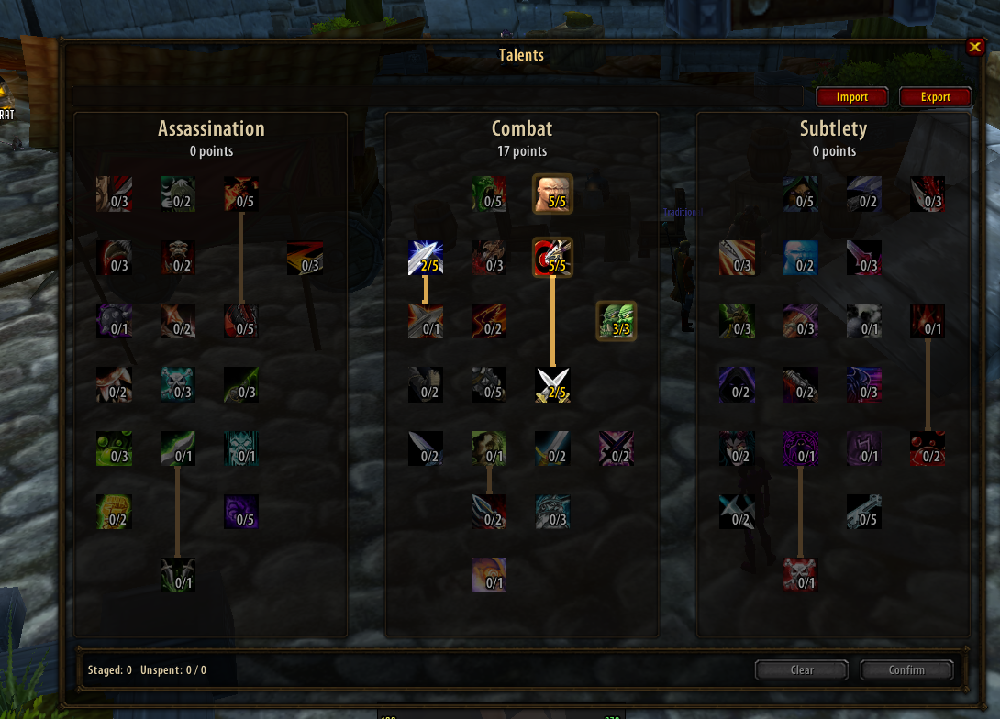
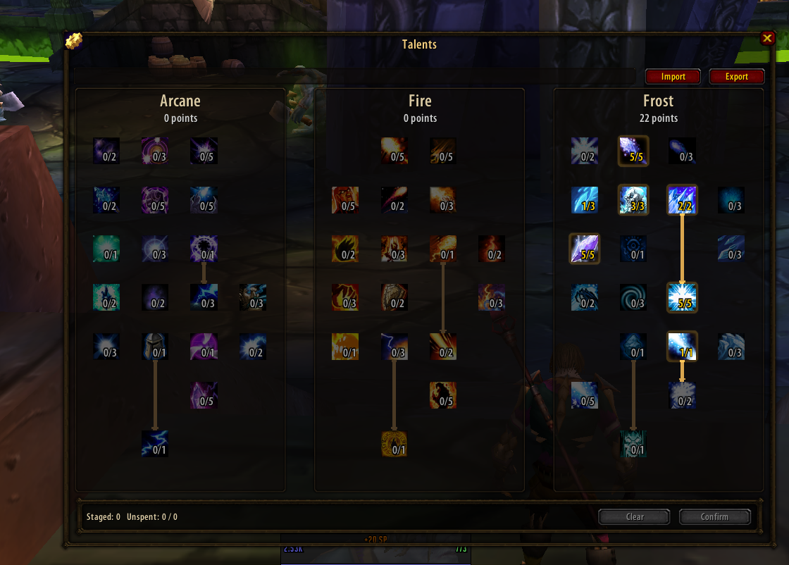

# Talent Stage

A drop-in replacement for the default WoW 1.12 talent frame. All three
specialization trees are visible at once, side by side, with no internal
scrolling — and a **stage-then-confirm** flow, so clicking a talent marks it
as planned without spending the point until you confirm.

Built for the stock 1.12.1 client used by Turtle WoW and OctoWoW-style
servers.

## Screenshots

## Features

- All three trees rendered together, sized to the tree's actual data —
  no fixed grid assumptions.
- Stage points across multiple talents, in any order, then confirm them all
  in one batch — no more one-point-at-a-time clicking and waiting.
- Prereq connector lines drawn from the tree's real prerequisite data, gold
  when met and gray when not, including diagonal branches.
- Build import/export via a compact text code, compatible with the codes
  produced by octowow.st's talent calculator.
- Matches your existing UI: detects pfUI or ElvUI and skins itself with
  their frame styling, falling back to a plain border when neither is
  loaded.

## Installation

1. Download this repository (clone it, or grab a release zip) and copy the
   `Interface/AddOns/TalentStage` folder into your WoW installation's
   `Interface/AddOns/` directory.
2. Launch the game, or if it's already running, type `/reload`.
3. Open your talent pane as usual (default `N` keybind, or the
   micro-menu button) — Talent Stage replaces it automatically.

Useful slash commands: `/ts` or `/talentstage` (with no arguments, lists the
available subcommands).

## Compatibility note

Talent Stage reads its data live from the client — `GetTalentInfo` and
`GetTalentPrereqs` — every time it draws a tree. It does not hardcode any
particular server's talent layout, tiers, columns, or prerequisites, so it
should work unmodified against any server running a stock-shaped 1.12
talent API, including servers that have customized their talent trees.

## Credits

- Talent Stage is written and maintained by **Azax**.
- The build import/export feature is compatible with the codes produced by
  [Haaxor1689/talent-builder](https://github.com/Haaxor1689/talent-builder)
  (used by octowow.st's talent calculator), which inspired the feature.
  Talent Stage's codec is an independent Lua implementation of the format —
  it reads and writes the same codes, but shares no code with that project.

## License

MIT — see [LICENSE](LICENSE).
